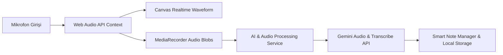

# 🎙️ Speech-to-Text & AI Audio Note Studio

[](https://www.typescriptlang.org/)
[](https://vitejs.dev/)
[](https://developer.mozilla.org/en-US/docs/Web/API/Web_Audio_API)
[](https://deepmind.google/technologies/gemini/)
[](https://www.yucelgumus.dev/)

> Mikrofon üzerinden yüksek kaliteli ses kaydı alan, canlı ses dalga formunu (audio waveform) HTML5 Canvas üzerinde görselleştiren, **Google Gemini AI** ile kayıtları kusursuz metne dönüştürüp akıllı özetler çıkaran ve notları organize eden modern ses kayıt stüdyosu.

---

## 🌟 Öne Çıkan Özellikler

- 🔊 **Gerçek Zamanlı Dalga Formu (Real-time Waveform Canvas):** Web Audio API Analyser düğümü ile mikrofon frekans ve genlik verilerini akıcı dalga animasyonuyla görselleştirme (`waveform.ts`).
- ⏱️ **Hassas Kayıt Sayacı & Duraklatma:** Süre takibi, kaydı duraklatma/devam ettirme ve ses kalitesi kontrolü (`timer.ts`, `recording-ui.ts`).
- 🤖 **Yapay Zeka Destekli Transkripsiyon & Metin Parlatma:** Ham ses verisini metne dönüştürür; anlatım bozukluklarını giderir, noktalama işaretlerini tamamlar ve özet çıkarır (`ai.service.ts`).
- 📝 **Akıllı Not Yöneticisi (Note Manager):** Alınan sesli notları etiketleme, düzenleme, Markdown / TXT olarak dışa aktarma ve yerel depolama (`storage.ts`).
- 🌗 **Karanlık / Aydınlık Tema Desteği:** Sistem tercihine duyarlı dinamik tema yönetimi (`theme.service.ts`).

---

## 🏗️ Mimari & Ses İşleme Hattı



| Modül | Görev |
| :--- | :--- |
| **`src/core/waveform.ts`** | 60 FPS HTML5 Canvas ses dalgası çizim motoru |
| **`src/core/recording-ui.ts`** | Kayıt butonları, animasyonlar ve mikrofon izin yönetimi |
| **`src/core/note-manager.ts`** | Transkript edilen notların listelenmesi, düzenlenmesi ve dışa aktarımı |
| **`src/services/ai.service.ts`** | Gemini AI ile metin düzeltme (polish), başlık ve özet üretimi |

---

## 🚀 Hızlı Başlangıç

### Gereksinimler
- **Node.js**: v18.0+
- **Google Gemini API Key** (veya bağlı BFF / Backend servisi)

### Kurulum

```bash
git clone https://github.com/yucel-gumus/speech-to-text.git
cd speech-to-text

npm install
```

### Ortam Değişkenleri (`.env`)

```env
VITE_GEMINI_API_KEY=your_gemini_api_key_here
```

### Çalıştırma

```bash
npm run dev
```

---

## 📂 Proje Dizin Yapısı

```
speech-to-text/
├── index.html
├── package.json
├── vite.config.ts
└── src/
    ├── main.ts
    ├── app.ts
    ├── core/
    │   ├── waveform.ts             # Dalga formu çizimi
    │   ├── recording-ui.ts         # Kayıt kontrolleri
    │   ├── timer.ts                # Sayaç yönetimi
    │   └── note-manager.ts         # Not düzenleme ve depolama
    ├── services/
    │   ├── audio.service.ts        # Ses yakalama ve blob oluşturma
    │   ├── ai.service.ts           # AI transkripsiyon servisi
    │   └── theme.service.ts        # Tema geçişi
    └── utils/
        ├── audio.ts                # Ses format dönüştürücüler
        ├── storage.ts              # LocalStorage yardımcıları
        └── dom.ts
```

---

## 📄 Lisans
Bu proje [MIT Lisansı](LICENSE) ile lisanslanmıştır.

---

## 👨‍💻 Geliştirici & İletişim

**Yücel Gümüş** - Full Stack Developer

- 🌐 **Web Sitesi / Portfolyo:** [yucelgumus.dev](https://www.yucelgumus.dev/)
- 💼 **LinkedIn:** [linkedin.com/in/yucel-gumus](https://www.linkedin.com/in/yucel-gumus/)
- 🐙 **GitHub:** [@yucel-gumus](https://github.com/yucel-gumus)

<p align="left">
  <a href="https://www.yucelgumus.dev/" target="_blank" rel="noopener noreferrer">
    
  </a>
</p>